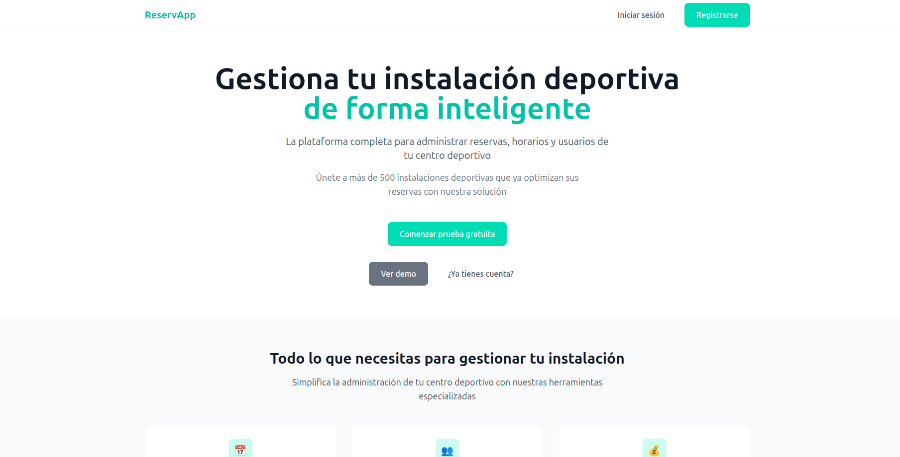
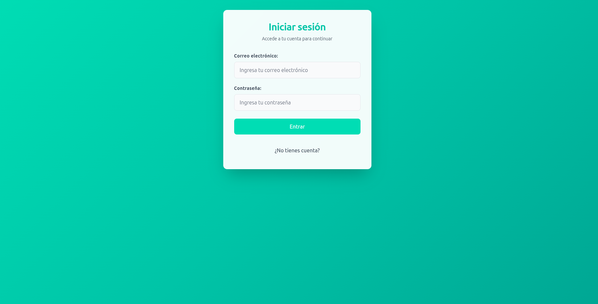
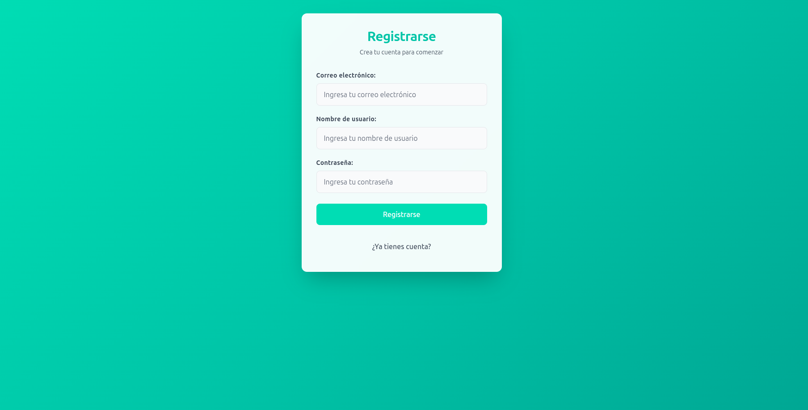
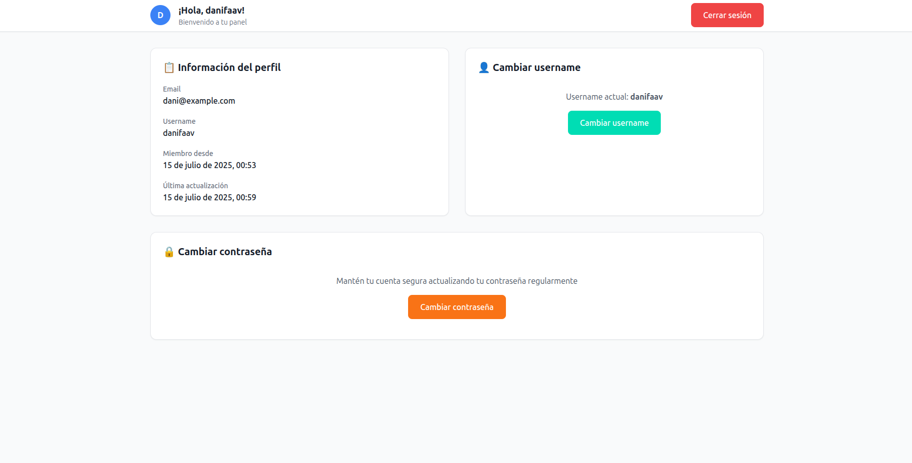
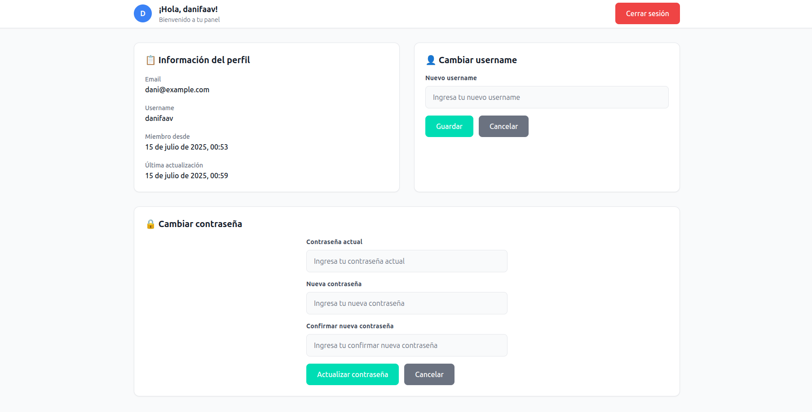

# Login Register App - Full Stack

<div align="center">


</div>

Aplicación completa de autenticación desarrollada con React, Node.js, Express y Prisma. Incluye sistema de login/registro, gestión de usuarios y una interfaz moderna con Tailwind CSS.

## 📸 Capturas de pantalla

### 🏠 Landing Page

*Página de inicio con diseño moderno y llamadas a la acción*

### 🔐 Sistema de Autenticación

*Formulario de login con validaciones en tiempo real*


*Registro de nuevos usuarios con feedback visual*

### 🏡 Dashboard de Usuario

*Panel principal para usuarios autenticados*

### 👤 Gestión de Perfil

*Formularios para actualizar username y contraseña*

### 📱 Diseño Responsive
<div style="display: flex; gap: 10px;">
  
  
  
</div>

## 🔗 Demo en vivo

> **Nota**: Para probar la aplicación, necesitarás clonar el repositorio y ejecutarlo localmente siguiendo las instrucciones de instalación.

### 🧪 Datos de prueba
Para facilitar las pruebas, puedes usar estos datos de ejemplo:
```
Email: demo@example.com
Password: demo123456
Username: demo_user
```

### 🎯 Flujo de prueba recomendado
1. 📄 Explora la **Landing Page** con todas sus secciones
2. 🔐 Prueba el **registro** de un nuevo usuario
3. 🔑 Haz **login** con las credenciales creadas
4. 🏠 Navega por el **dashboard** de usuario
5. ⚙️ Actualiza tu **username** y **contraseña**
6. 📱 Prueba la **responsividad** en diferentes dispositivos

## ⭐ Características destacadas

<div align="center">

| 🎨 **Frontend** | 🔧 **Backend** | 🔒 **Seguridad** |
|----------------|----------------|------------------|
| React 19 + Hooks | Express.js API | JWT Authentication |
| Tailwind CSS | Prisma ORM | bcrypt Encryption |
| React Router | SQLite Database | Input Validation |
| Axios Integration | RESTful Endpoints | Protected Routes |
| Responsive Design | Error Handling | CORS Configuration |

</div>

### 🎯 Casos de uso
- **🏢 Aplicaciones empresariales** que necesiten autenticación robusta
- **📚 Proyectos educativos** para aprender full-stack development
- **🚀 Startups** que busquen un boilerplate de autenticación
- **👨‍💻 Desarrolladores** que quieran un ejemplo de mejores prácticas

##�🚀 Tecnologías utilizadas

### Frontend
- **React 19.1.0** - Framework principal
- **React Router DOM 7.6.3** - Enrutamiento de la aplicación
- **Tailwind CSS 3.4.17** - Framework de CSS
- **Axios 1.10.0** - Cliente HTTP para APIs
- **Context API** - Gestión del estado de autenticación

### Backend
- **Node.js** - Runtime de servidor
- **Express 5.1.0** - Framework web
- **Prisma 6.11.1** - ORM para base de datos
- **SQLite** - Base de datos
- **JWT (jsonwebtoken 9.0.2)** - Autenticación con tokens
- **bcryptjs 3.0.2** - Encriptación de contraseñas
- **CORS 2.8.5** - Cross-Origin Resource Sharing

## 📁 Estructura del proyecto

```
TestingReact/
├── frontend/                    # Aplicación React
│   ├── src/
│   │   ├── components/         # Componentes reutilizables
│   │   │   ├── Button.jsx
│   │   │   ├── Container.jsx
│   │   │   ├── Features.jsx
│   │   │   ├── Footer.jsx
│   │   │   ├── Header.jsx
│   │   │   ├── Hero.jsx
│   │   │   ├── HowItWorks.jsx
│   │   │   ├── MessageDisplay.jsx
│   │   │   ├── PasswordForm.jsx
│   │   │   ├── ProfileCard.jsx
│   │   │   ├── Testimonials.jsx
│   │   │   ├── TextInput.jsx
│   │   │   └── UsernameForm.jsx
│   │   ├── contexts/           # Context de React
│   │   │   └── AuthContext.js  # Gestión del estado de autenticación
│   │   ├── pages/             # Páginas de la aplicación
│   │   │   ├── Home.jsx       # Dashboard para usuarios autenticados
│   │   │   ├── LandingPage.jsx # Página de inicio
│   │   │   └── Login.jsx      # Login y registro
│   │   ├── services/          # Servicios de API
│   │   │   └── api.js         # Cliente HTTP con axios
│   │   └── utils/             # Utilidades
│   ├── public/                # Archivos estáticos
│   └── build/                 # Build de producción
├── backend/                   # API Node.js
│   ├── controllers/           # Controladores
│   │   ├── authController.js  # Lógica de autenticación
│   │   └── userController.js  # Gestión de usuarios
│   ├── middlewares/           # Middlewares
│   │   └── auth.js           # Verificación de JWT
│   ├── prisma/               # Configuración de Prisma
│   │   ├── schema.prisma     # Esquema de base de datos
│   │   └── dev.db           # Base de datos SQLite
│   ├── routes/               # Rutas de la API
│   │   ├── auth.js          # Rutas de autenticación
│   │   └── user.js          # Rutas de usuario
│   ├── utils/                # Utilidades del backend
│   │   ├── authUtils.js     # Utilidades de autenticación
│   │   ├── passwordUtils.js # Gestión de contraseñas
│   │   └── userDTO.js       # DTOs para datos de usuario
│   └── index.js             # Servidor principal
└── README.md                # Este archivo
```

## ✨ Funcionalidades implementadas

### Frontend
- ✅ **Landing Page moderna** con secciones completas
- ✅ **Sistema de autenticación** completo (login/registro)
- ✅ **Rutas protegidas** con React Router
- ✅ **Context API** para gestión del estado global
- ✅ **Dashboard de usuario** con perfil y gestión de cuenta
- ✅ **Formularios de actualización** de username y contraseña
- ✅ **Manejo de errores** y validaciones
- ✅ **Interfaz responsive** con Tailwind CSS
- ✅ **Loading states** y feedback visual
- ✅ **Interceptores de axios** para manejo automático de tokens

### Backend
- ✅ **API RESTful** con Express
- ✅ **Base de datos** con Prisma ORM y SQLite
- ✅ **Autenticación JWT** segura
- ✅ **Encriptación de contraseñas** con bcrypt
- ✅ **Middlewares de autenticación**
- ✅ **Validaciones** de datos de entrada
- ✅ **DTOs** para transferencia de datos
- ✅ **CORS** configurado para desarrollo
- ✅ **Controladores organizados** por funcionalidad
- ✅ **Manejo de errores** centralizado

### Endpoints de la API
- `POST /api/auth/register` - Registro de usuarios
- `POST /api/auth/login` - Inicio de sesión
- `GET /api/auth/verify` - Verificación de token
- `PUT /api/user/username` - Actualización de username
- `PUT /api/user/password` - Cambio de contraseña
- `GET /api/user/profile` - Obtener perfil del usuario

## 🛠️ Instalación y configuración

### ⚡ Instalación rápida

```bash
# 1. Clonar el repositorio
git clone https://github.com/danilo-ck/TestingReact.git
cd TestingReact

# 2. Instalar dependencias del backend
cd backend
npm install

# 3. Configurar la base de datos
npm run db:generate
npm run db:push

# 4. Instalar dependencias del frontend
cd ../frontend
npm install

# 5. ¡Listo! Ahora puedes ejecutar la aplicación
```

### 📋 Prerequisitos
- Node.js (versión 16 o superior)
- npm o yarn

### Instalación

1. **Clonar el repositorio**
```bash
git clone https://github.com/tu-usuario/TestingReact.git
cd TestingReact
```

2. **Configurar el Frontend**
```bash
cd frontend
npm install
```

3. **Configurar el Backend**
```bash
cd ../backend
npm install
```

4. **Configurar la base de datos**
```bash
# En el directorio backend
npm run db:generate
npm run db:push
```

## 🚀 Ejecución del proyecto

### 🔥 Desarrollo (modo dev)

**Terminal 1 - Backend:**
```bash
cd backend
npm run dev
# ✅ Servidor corriendo en http://localhost:5000
```

**Terminal 2 - Frontend:**
```bash
cd frontend
npm start
# ✅ Aplicación abierta en http://localhost:3000
```

### 🎯 Producción
1. **Iniciar el backend**
```bash
cd backend
npm run dev
# El servidor se ejecuta en http://localhost:5000
```

2. **Iniciar el frontend** (en otra terminal)
```bash
cd frontend
npm start
# La aplicación se abre en http://localhost:3000
```

### Producción
1. **Build del frontend**
```bash
cd frontend
npm run build
```

2. **Iniciar el backend**
```bash
cd backend
npm start
```

## 📊 Scripts disponibles

### Frontend
- `npm start` - Inicia el servidor de desarrollo
- `npm run build` - Crea el build de producción
- `npm test` - Ejecuta las pruebas
- `npm run eject` - Expone la configuración de React Scripts

### Backend
- `npm run dev` - Inicia el servidor con nodemon (desarrollo)
- `npm start` - Inicia el servidor (producción)
- `npm run db:generate` - Genera el cliente de Prisma
- `npm run db:push` - Sincroniza el esquema con la base de datos
- `npm run db:migrate` - Ejecuta migraciones
- `npm run db:studio` - Abre Prisma Studio

## 🔧 Troubleshooting

### Problemas comunes

<details>
<summary>❌ Error: "Cannot connect to database"</summary>

**Solución:**
```bash
cd backend
npm run db:generate
npm run db:push
```
</details>

<details>
<summary>❌ Error: "Port 3000 already in use"</summary>

**Solución:**
- Cambia el puerto en `frontend/package.json` o
- Mata el proceso: `kill -9 $(lsof -t -i:3000)`
</details>

<details>
<summary>❌ Error: "CORS policy"</summary>

**Solución:**
Verifica que el backend esté ejecutándose en `http://localhost:5000`
</details>

<details>
<summary>❌ La aplicación no carga después del build</summary>

**Solución:**
```bash
cd frontend
rm -rf build node_modules
npm install
npm run build
```
</details>

### 📚 FAQs

**Q: ¿Puedo usar otra base de datos además de SQLite?**
A: Sí, solo cambia el provider en `backend/prisma/schema.prisma` y actualiza la URL de conexión.

**Q: ¿Cómo añado más campos al usuario?**
A: Modifica el modelo User en `schema.prisma`, ejecuta `npm run db:push` y actualiza los DTOs.

**Q: ¿Puedo usar este proyecto como base para otros?**
A: ¡Absolutamente! Está diseñado como boilerplate reutilizable.

## 🔒 Seguridad

- **Contraseñas encriptadas** con bcrypt
- **Tokens JWT** para autenticación
- **Validación de datos** en frontend y backend
- **Middleware de autenticación** para rutas protegidas
- **CORS** configurado correctamente
- **Headers de seguridad** implementados

## 🎨 Características de UI/UX

- **Diseño moderno** y responsive
- **Tema consistente** con Tailwind CSS
- **Feedback visual** para todas las acciones
- **Loading states** durante las operaciones
- **Manejo de errores** user-friendly
- **Navegación intuitiva** con React Router
- **Componentes reutilizables**

## 📱 Responsive Design

La aplicación está completamente optimizada para:
- **Desktop** (1024px+)
- **Tablet** (768px - 1023px)
- **Mobile** (320px - 767px)

## 🔄 Estado del desarrollo

- ✅ **Arquitectura base** - Frontend y Backend configurados
- ✅ **Sistema de autenticación** - Login, registro y JWT
- ✅ **Base de datos** - Prisma con SQLite
- ✅ **Frontend completo** - Landing page, dashboard y formularios
- ✅ **API completa** - Todos los endpoints implementados
- ✅ **Integración** - Frontend y backend comunicándose
- ✅ **Gestión de estado** - Context API implementado
- ✅ **Rutas protegidas** - Navegación segura
- ✅ **UI/UX** - Interfaz moderna y responsive

## 🚧 Próximas mejoras

- [ ] **Testing** - Implementar pruebas unitarias y de integración
- [ ] **TypeScript** - Migrar a TypeScript para mejor type safety
- [ ] **Docker** - Containerización del proyecto
- [ ] **Deploy** - Configuración para producción
- [ ] **Email verification** - Verificación de email en registro
- [ ] **Password recovery** - Sistema de recuperación de contraseña
- [ ] **User roles** - Sistema de roles y permisos
- [ ] **Profile photos** - Upload de imágenes de perfil

## 🤝 Contribución

¡Las contribuciones son bienvenidas! Si quieres contribuir:

1. 🍴 Fork el proyecto
2. 🌿 Crea una rama para tu feature (`git checkout -b feature/AmazingFeature`)
3. 💾 Commit tus cambios (`git commit -m 'Add some AmazingFeature'`)
4. 📤 Push a la rama (`git push origin feature/AmazingFeature`)
5. 🔄 Abre un Pull Request

### 🐛 Reportar bugs
Si encuentras un bug, por favor abre un [issue](https://github.com/danilo-ck/TestingReact/issues) con:
- Descripción detallada del problema
- Pasos para reproducirlo
- Screenshots si es posible
- Tu entorno (OS, Node version, etc.)

## 👨‍💻 Autor

**Danilo CK**
- GitHub: [@danilo-ck](https://github.com/danilo-ck)
- LinkedIn: [Mi LinkedIn](https://linkedin.com/in/daniel-farré-avilés)

## ⭐ Dale una estrella

Si este proyecto te fue útil, ¡considera darle una estrella! ⭐

## 📄 Licencia

Este proyecto está bajo la Licencia MIT - ver el archivo [LICENSE](LICENSE) para más detalles.

---

<div align="center">

**¿Te gustó el proyecto? ¡Dale una ⭐ en GitHub!**

Made with ❤️ by [Danilo CK](https://github.com/danilo-ck)

</div>
